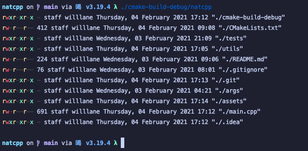

# Nat C++



### Adding arg parse lib
Download latest release from [here](https://github.com/CLIUtils/CLI11/releases)
put .hpp file in include/CLI11.hpp

### Testing
```bash
cd tests

./run_tests.sh
```

### Writing tests
1. Add test function to tests/main.cpp
2. Update run_tests.sh to include new cpp files to link
3. Run run_tests.sh to make sure everything passes