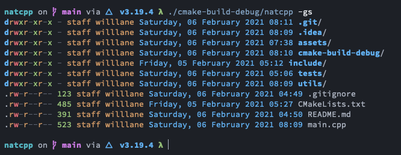

# Nat C++



### Testing
```bash
cd tests

./run_tests.sh
```

### Writing tests
1. Add test function to tests/main.cpp
2. Update run_tests.sh to include new cpp files to link
3. Run run_tests.sh to make sure everything passes